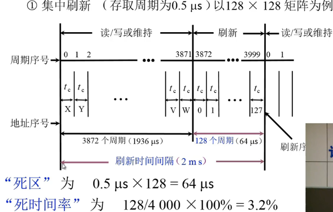
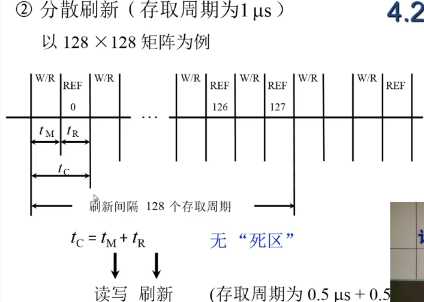
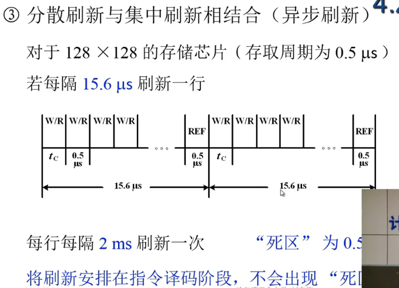
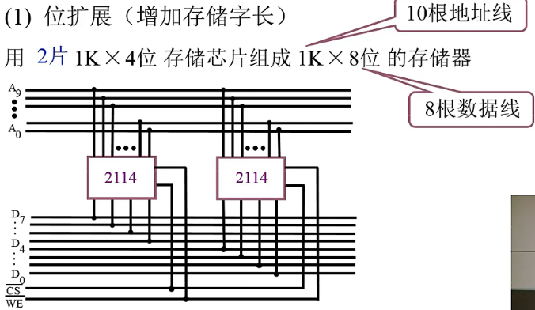
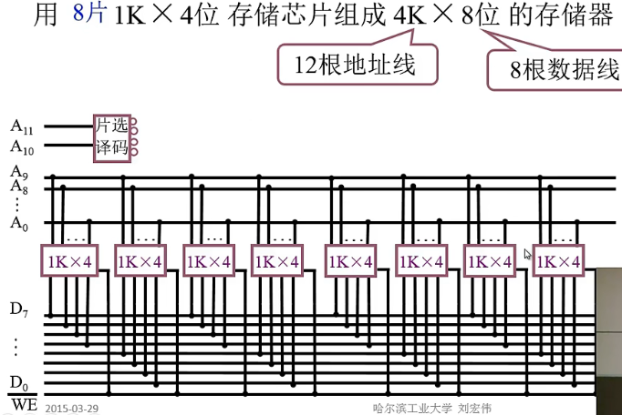
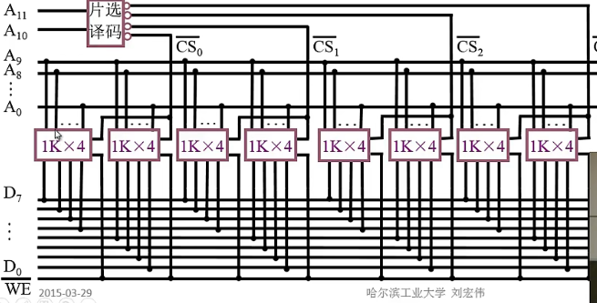

# 第五章：内部存储器
1.半导体存储器的相似性质
> - 呈现**两种稳态**（或者半稳态），分别代表0或1
> - 能**写入**以设置状态
> - 能**读出**状态信息  

## 半导体存储器
1.随机存取、顺序存取、直接存取
> 随机存取->当存储器中的数据被读取或写入时，所需要的时间与该数据所在的物理地址无关（***数组***）  
>>内存条  

> 顺序存取->进行读、写操作的存取方法，所需要的时间与该数据所在的物理地址有关。顺序存取表现为:在存取第N个数据时，必须先访问前（N-1）个数据   （***链表***）  
>> 录音磁带、光盘、机械硬盘  

2.半导体存储类型
> |类型|种类|可擦除性|写机制|易失性|  
> |-|-|-|-|-|  
> |RAM（随机存取存储器）|读-写|电可擦除，Byte级|电|易|
> |ROM（只读存储器）|只读|不可|掩膜|非|
> |PROM（可编程）|只读(可写一次）|不可|电|非|
> |EPROM（可擦除）|主要读|紫外线可擦除，芯片级|电|非|
> |EEPROM（电可擦除）|主要读|电可擦除，Byte级|电|非|
> |FLASH（闪存）|主要读|电可擦除，Block级|电|非|

### RAM和ROM
* RAM  
  * 通过电信号读写
  * 易失，断电丢数
  * 分为SRAM和DRAM  
  * DRAM的刷新定义：使DRAM芯片丧失读写能力而刷新所有数据位元  
    SRAM和DRAM的对比  
    |  |SRAM|DRAM|  
    |-|-|-|
    |位元保存01原理|双稳态触发器|电容|
    |结构|复杂|简单|
    |位元大小|大|小|
    |密度|小|大|
    |价格|**贵**|便宜|
    |速度|慢|**快**|
    |适配用途|主存|*Cache*|
    |**特殊要求**| |要求有支持*刷新*的电路|  
    
    tip:刷新方式有3种
    > ***(1)集中刷新***
      
    >
    > ***(2)分散刷新***  
      
    >  
    > ***(3)异步刷新***
      

* ROM  
   * 固化数据需要较大成本
   * 无出错机会
   * 需求少时，可用PROM代替。PROM也非易失，但可以写入一次（**也仅仅一次**），且需要特殊设备 
    * EPROM比PROM更贵（等储量下），但可多次改写
    * EEPROM比EPROM更贵，且密度低，支持小容量芯片（***在写入之前不需要擦除操作***）
    * FLASH闪存**价格**和**功能**在EEPROM和EPROM之间，速度比EEPROM快得多  
  

* 多体交叉存储器
  * 主存储器由多块DRAM构成，组成*存储体*（memory bank）
    

## 纠错码
### 一、汉明码  
1）校验位  

> 即k个校验位加上n个信息位加1个正确状态共（**n+k**）个位+**1**种情况  
>  总共$2^k$种状态，每种状态指出一个特定的位（出错）  

2）整体校验过程
    
> 类似于奇偶校验  
     

    
---  

## 高级DRAM组织
- 同步DRAM（SDRAM）
  > 与CPU的数据交换同步于外部时钟信号  
  > 以CPU/存储器总线的最高速度运行，而不需要插入等待状态
- Rambus DRAM
  > 非常精确定义了**阻抗、时序**和**信号**，不像传统DRAM采用RAS、CAS、R/W、CE信号来控制  
  > 通过高速总线获得存储器请求，包括**操作时所需地址、操作类型**和**字节数**
- DDR DRAM  
  > SDRAM受限与每个时钟周期只能发送一次数据到处理器，双速率SDRAM能发两次，一次上升沿，一次下降沿

---
## 存储器与CPU连接
- 位扩展
  
- 字扩展
  
   
例子  
  

  
  
