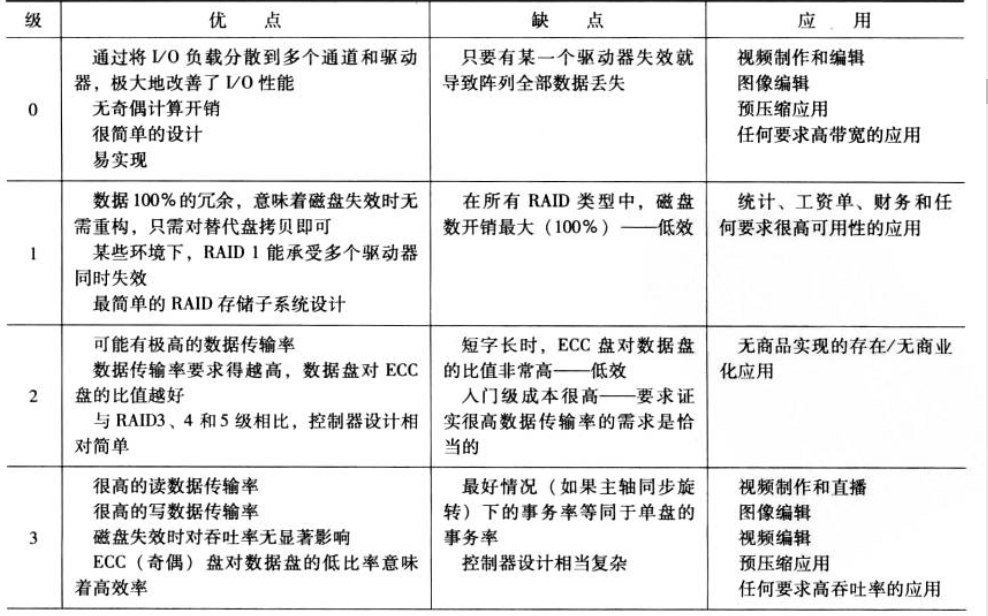
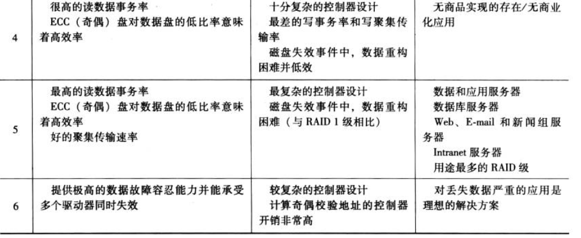

# 第六章：外部存储器  
  一、磁盘  
  > - 数据记录和读出通过  ***磁头***
  >> 过程中磁头静止不动，***盘片***高速旋转  
  > - 数据组织和格式化  
  >> 盘片上的数据组织呈现为一组同心圆环，即***磁道***  
  >> 每个磁道与磁头**同宽**，每个盘面上有数千个磁道  
  >>  
   磁盘数据分布如下  

     
    
  > - 盘面布局  
  >> 1）恒定角速度（*CAV*）  
  >> -  pros: 能以*磁道号*和*扇区号*来直接寻址数据  
  >>      
  >> - cons: **外围的长磁道存储数据需要和内圈短磁道一样多**  ！！  
  >>        也就意味着存储容量收到内圈***线密度***限制  
  >>  
  >>  
  >>  - 顺序： ① 磁头径向确定磁道--->②等待指定扇区转到磁头下 
  >> 
  >> 2）多带式记录(*MZR*)  
  >> - 在一个区域中，各磁道**位数**恒定  
  > - 物理特性 
  >> 区分各类磁盘的主要特性  
  >    
  > 
  >
  > 利用***磁头***机制可以把磁盘分为***3大类***
  >> 1.读写头在盘片上方固定距离，允许有一个气隙————***常规刚性盘***  
  >> 2.读写头读写时实际接触磁表面————***软盘***  
  >> 3.盘动时，磁头分离；不动时，气垫接触表面————***温氏磁盘***  
## 磁盘性能参数  
下图为磁盘传送数据时序图  
  
  
    
- **寻道时间**  
  > 磁头定位到磁道处  
- **旋转延迟**  
  > 扇区转到磁头处
- **传送时间**  
  > 传输数据   
  
$$存取时间=寻道时间+旋转延迟（+传送时间）$$  
>  
>  
>   
  
二、***RAID***  
具体见知乎[  各种RAID及其性能分析  ](https://zhuanlan.zhihu.com/p/51170719)  
***强推视频***！！[磁盘阵列是什么东西？为什么需要磁盘阵列？不同阵列之间的区别](https://www.bilibili.com/video/BV1VJ411s7T5/?spm_id_from=333.788.recommend_more_video.-1&vd_source=90b363ba29c02cee9483f8af72326735)  
> tips:  
> 查看服务器是否安装磁盘冗余阵列以及第几代，使用命令*lsblk*  
> 
>    
>   
>> **在RAID环境中，并行存取和独立存取有何不同？**  
>> - 在并行存取阵列中，所有的磁盘成员都参与每个I/O请求的执行。一般情况下，各个驱动器的轴是同步旋转的，因此，每个磁盘上的每个磁头在任何时刻都位于同一
位置。
>> - 在独立存取阵列中，每个磁盘成员的操作是独立的，因此各个I/O请求能够并行处
理。基于此原因，独立存取阵列更适合于需要高速I/O请求的应用，而相对较少用于需要高数据传输率的场合。

### 非重点   
三、***光存储器***  
四、***磁带***